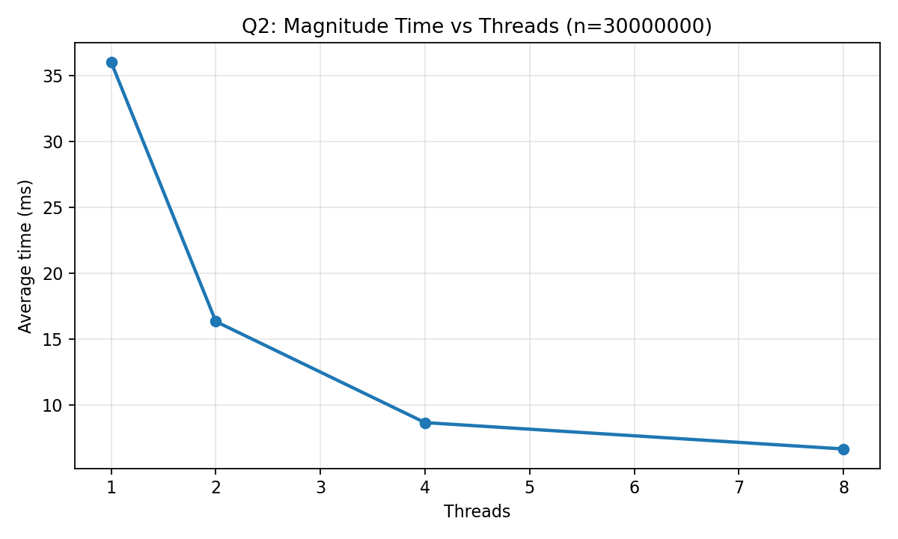
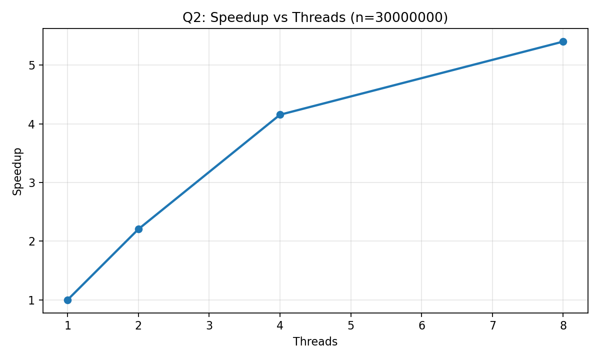

# Lab Activity 1 (5%) Report

This report satisfies the Lab 1 requirements for:

- Section 1: Question 1 (Code Optimization)
- Section 2: Question 2 (Parallelize Code)

## Environment

Hardware:

- CPU: Apple M1
- Cores/Threads: 8/8
- RAM: 8 GB
- OS: macOS 26.3 (Build 25D125)

Software / methodology:

- Compiler: Apple clang 21.0.0
- Timing method: `std::chrono::steady_clock` (milliseconds)
- Runs per configuration: 3 (average reported)

Key formula (magnitude / Euclidean norm):

$$
\lVert x \rVert = \sqrt{\sum_{i=1}^{n} x_i^2}
$$

Variables:

- $x$: input vector/array of length $n$
- $x_i$: value of the $i$-th element
- $n$: number of elements in the array (problem size)
- $\lVert x \rVert$: magnitude (Euclidean norm)

Note: In code, arrays are 0-indexed (indices $0..n-1$). The math above uses $1..n$.

---

## Section 1: Question 1 (Code Optimization)

### Goal

Measure how compiler optimization flags affect runtime for the provided magnitude computation.

### Build Configurations

| Optimization | Build command |
|---|---|
| O0 | `clang++ -O0 -std=c++17 q1.cpp -o q1_O0` |
| O2 | `clang++ -O2 -std=c++17 q1.cpp -o q1_O2` |
| O3 | `clang++ -O3 -std=c++17 q1.cpp -o q1_O3` |

Inputs tested:

- `n`: 1,000,000; 3,000,000; 10,000,000; 30,000,000

### Results (Magnitude Calculation)

Average magnitude calculation time (ms):

| n | O0 avg (ms) | O2 avg (ms) | O3 avg (ms) |
|---:|---:|---:|---:|
| 1,000,000 | 3.3333 | 0.3333 | 0.3333 |
| 3,000,000 | 10.6667 | 3.0000 | 3.0000 |
| 10,000,000 | 37.6667 | 11.0000 | 11.0000 |
| 30,000,000 | 116.3333 | 33.3333 | 33.6667 |

### Visualization

### Regression Analysis

Model:

$$
time_{ms}(n) = a\,n + b
$$

Variables:

- $time_{ms}(n)$: average magnitude-calculation time in milliseconds for input size $n$
- $n$: number of elements
- $a$: slope (ms per element)
- $b$: intercept (ms)
- $R^2$: coefficient of determination (goodness of fit; closer to 1 is better)

Fit results (magnitude calculation time):

| Optimization | a (ms/element) | a (ms per 1e6 elements) | b (ms) | R^2 |
|---|---:|---:|---:|---:|
| O0 | 3.9049e-06 | 3.9049 | -0.9544 | 0.99996 |
| O2 | 1.1312e-06 | 1.1312 | -0.5263 | 0.99979 |
| O3 | 1.1432e-06 | 1.1432 | -0.5754 | 0.99985 |

Interpretation:

- High `R^2` indicates runtime is approximately linear in `n` over the tested range.
- Enabling optimization (`-O2`/`-O3`) significantly reduces the per-element cost (smaller slope).

### Discussion

- Runtime increased roughly linearly with `n`.
- `-O2` and `-O3` performed similarly on this workload; most improvement came from enabling optimizations vs `-O0`.
- Some variability is expected due to millisecond timing resolution and OS scheduling.

Raw data files:

- `q1_raw_timings.csv`
- `q1_summary.csv`

---

## Section 2: Question 2 (Parallelize Code)

### Theoretical Speedup Estimate

Definitions:

- `T1`: time with 1 thread
- `Tp`: time with `p` threads
- `alpha`: fraction of runtime that can be parallelized

Formulas:

$$
Speedup(p) = \frac{T_1}{T_p}
$$

$$
Efficiency(p) = \frac{Speedup(p)}{p}
$$

$$
S_{Amdahl}(p) = \frac{1}{(1-\alpha) + \alpha/p}
$$

$$
\alpha = \frac{T_{parallel}}{T_{parallel} + T_{serial}}
$$

Variables:

- $p$: number of threads
- $T_1$: average runtime with 1 thread (baseline), in ms
- $T_p$: average runtime with $p$ threads, in ms
- $Speedup(p)$: how many times faster the $p$-thread run is vs 1 thread
- $Efficiency(p)$: speedup per thread
- $\alpha$: parallel fraction of runtime ($0 \le \alpha \le 1$)
- $T_{parallel}$: time spent in the parallelizable portion
- $T_{serial}$: time spent in the non-parallelizable portion
- $S_{Amdahl}(p)$: predicted speedup from Amdahl's Law

In this report, the measured $T_p$ used for speedup/efficiency is taken from the program's printed "magnitude calculation" timer.

Estimate `alpha` using Q1 (O2) at `n = 30,000,000`:

- `T_serial = T_alloc_init = 19.3333 ms`
- `T_parallel = T_mag = 33.3333 ms`
- `alpha = 33.3333 / (19.3333 + 33.3333) = 0.6329`

Amdahl speedup estimates (total runtime model):

- `S_amdahl(2) = 1.4630`
- `S_amdahl(4) = 1.9036`
- `S_amdahl(8) = 2.2411`

Note: This Amdahl estimate includes the serial allocation/initialization portion. The observed speedup below is computed from the magnitude timer only.

### Decomposition Pattern Used (and Why)

- **Geometric Decomposition (1D)**: split the index range `[0, n)` into `p` contiguous chunks.
- **Fork/Join**: create `p` threads, wait for them to finish.
- **Map-Reduce**: each thread computes a partial sum of squares (map), then the main thread sums partials and applies `sqrt` (reduce).

This fits the workload because each element can be processed independently and only one reduction is needed at the end.

### Implementation Summary

Program: `q2.cpp`

- Command line: `./q2 <n> <numThreads>`
- Partitioning:
  - $chunk = \lceil n/p \rceil$
  - thread $t$ handles indices $[t\cdot chunk,\; \min(n,(t+1)\cdot chunk))$
- Each thread computes:
  - `partial[t] = sum_{i=start..end-1} x[i]^2`
- Final result:
  - `sqrt(sum(partial))`

Variables:

- $n$: number of elements
- $p$: number of threads
- $chunk = \lceil n/p \rceil$: elements per thread (rounded up)
- $t$: thread index, $t \in \{0, 1, \dots, p-1\}$
- $start = t\cdot chunk$
- $end = \min(n, (t+1)\cdot chunk)$
- $partial[t]$: partial sum of squares computed by thread $t$

Reduction:

$$
sum = \sum_{t=0}^{p-1} partial[t]\quad\Rightarrow\quad \lVert x \rVert = \sqrt{sum}
$$

### Results

Timing used for speedup/efficiency: magnitude calculation time only.

Note on measurement resolution:

- Output is in milliseconds; for small `n`, some multi-threaded runs measure as `0 ms`, producing infinite speedup.
- Focus on larger `n` where times are above timer resolution.

Results (from `q2_summary.csv`):

| n | threads | avg time (ms) | speedup | efficiency |
|---:|---:|---:|---:|---:|
| 10,000,000 | 1 | 12.0000 | 1.0000 | 1.0000 |
| 10,000,000 | 2 | 5.0000 | 2.4000 | 1.2000 |
| 10,000,000 | 4 | 2.6667 | 4.5000 | 1.1250 |
| 10,000,000 | 8 | 2.3333 | 5.1429 | 0.6429 |
| 30,000,000 | 1 | 36.0000 | 1.0000 | 1.0000 |
| 30,000,000 | 2 | 16.3333 | 2.2041 | 1.1020 |
| 30,000,000 | 4 | 8.6667 | 4.1538 | 1.0385 |
| 30,000,000 | 8 | 6.6667 | 5.4000 | 0.6750 |

Worked example (how to compute speedup/efficiency):

For $n=30{,}000{,}000$ and $p=4$:

- $T_1 = 36.0000\,ms$
- $T_4 = 8.6667\,ms$

$$
Speedup(4) = \frac{T_1}{T_4} = \frac{36.0000}{8.6667} \approx 4.1538
$$

$$
Efficiency(4) = \frac{Speedup(4)}{4} \approx \frac{4.1538}{4} = 1.0385
$$

### Visualizations

### Comparison: Theoretical vs Observed

- Theoretical (`S_amdahl`, total-runtime model at `n=30,000,000`):
  - `S(2)=1.4630`, `S(4)=1.9036`, `S(8)=2.2411`
- Observed (magnitude timer only, `n=30,000,000`):
  - `S(2)=2.2041`, `S(4)=4.1538`, `S(8)=5.4000`

Why they differ:

- The Amdahl estimate includes serial allocation/initialization, but the observed speedup uses magnitude time only.
- Thread overhead (create/join) and the final reduction prevent perfect scaling.
- Memory bandwidth/cache effects and scheduling lead to diminishing returns as `p` increases.

### Discussion (Scalability, Diminishing Returns, Overhead)

- Speedup improves as threads increase, but efficiency decreases at higher thread counts due to overhead and shared hardware limits.
- Some efficiency values slightly above 1 can occur due to coarse millisecond timing resolution and run-to-run variability.

Raw data files:

- `q2_raw_timings.csv`
- `q2_summary.csv`
