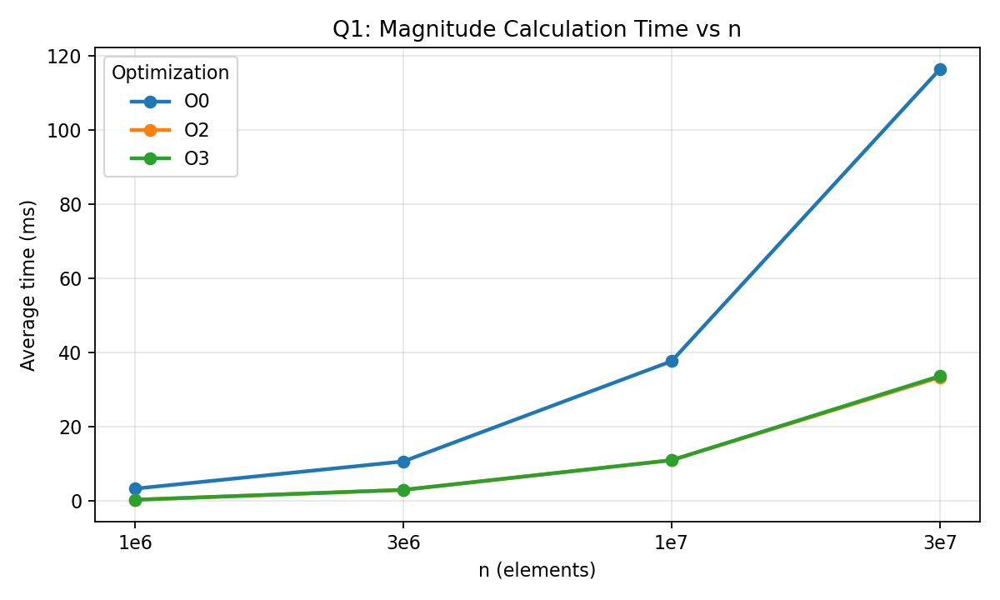

# Lab 1 - Question 1 (Code Optimization)

## Hardware Used

- CPU: Apple M1
- Cores/Threads: 8/8
- RAM: 8 GB
- OS: macOS 26.3 (Build 25D125)

## Methodology

- Compiler: Apple clang 21.0.0
- Timing: `std::chrono::steady_clock`, milliseconds
- Runs: 3 per (optimization level, n), report average
- Inputs (`n`): 1,000,000; 3,000,000; 10,000,000; 30,000,000

Build configurations:

| Optimization | Flags |
|---|---|
| O0 | `clang++ -O0 -std=c++17 q1.cpp -o q1_O0` |
| O2 | `clang++ -O2 -std=c++17 q1.cpp -o q1_O2` |
| O3 | `clang++ -O3 -std=c++17 q1.cpp -o q1_O3` |

## Results (Magnitude Calculation)

Average magnitude calculation time (ms):

| n | O0 avg (ms) | O2 avg (ms) | O3 avg (ms) |
|---:|---:|---:|---:|
| 1,000,000 | 3.3333 | 0.3333 | 0.3333 |
| 3,000,000 | 10.6667 | 3.0000 | 3.0000 |
| 10,000,000 | 37.6667 | 11.0000 | 11.0000 |
| 30,000,000 | 116.3333 | 33.3333 | 33.6667 |

## Visualization

## Discussion

- Runtime increased approximately linearly with `n` over the tested range.
- Enabling optimizations (`-O2`/`-O3`) significantly reduced magnitude runtime vs `-O0`.
- `-O2` and `-O3` performed similarly for this workload.
- Small run-to-run differences are expected because timing resolution is milliseconds and the OS may schedule background work.

## Regression Analysis

Linear model: `time_ms = a * n + b`

| Optimization | a (ms/element) | a (ms per 1e6 elements) | b (ms) | R^2 |
|---|---:|---:|---:|---:|
| O0 | 3.9049e-06 | 3.9049 | -0.9544 | 0.99996 |
| O2 | 1.1312e-06 | 1.1312 | -0.5263 | 0.99979 |
| O3 | 1.1432e-06 | 1.1432 | -0.5754 | 0.99985 |

Interpretation:

- High R^2 indicates the runtime is well-approximated by a linear function of `n` for these experiments.
- The slope `a` estimates the average compute cost per processed element.

## Raw Data

- `q1_raw_timings.csv` (all runs)
- `q1_summary.csv` (averages)
