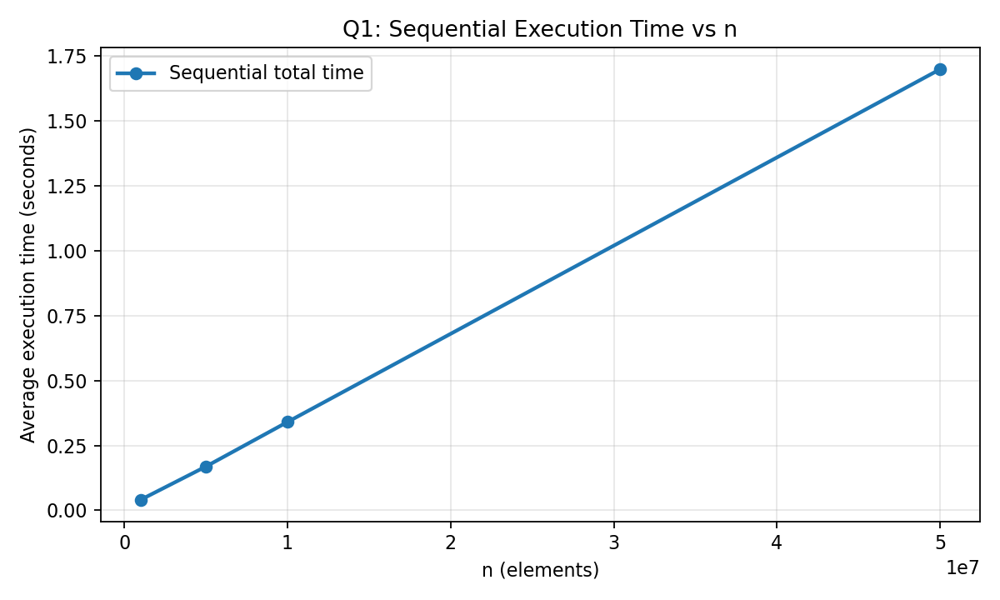
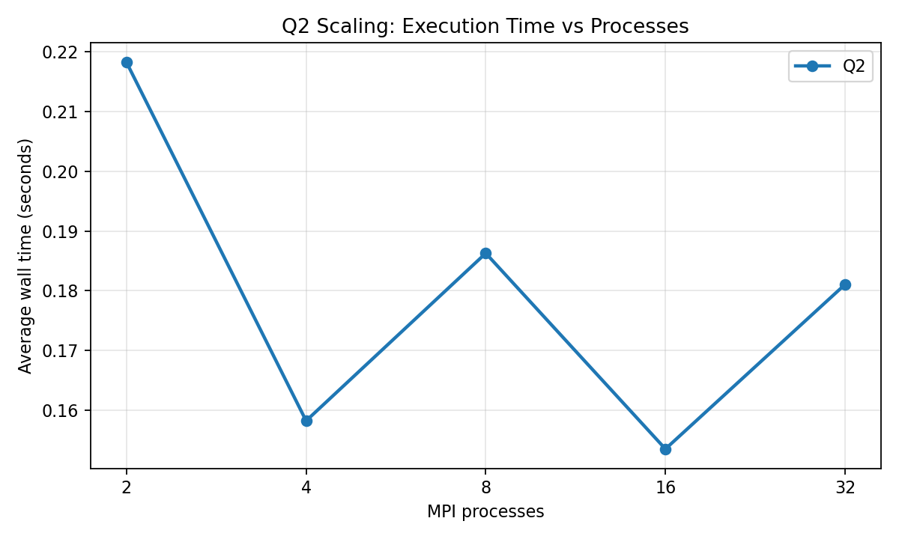
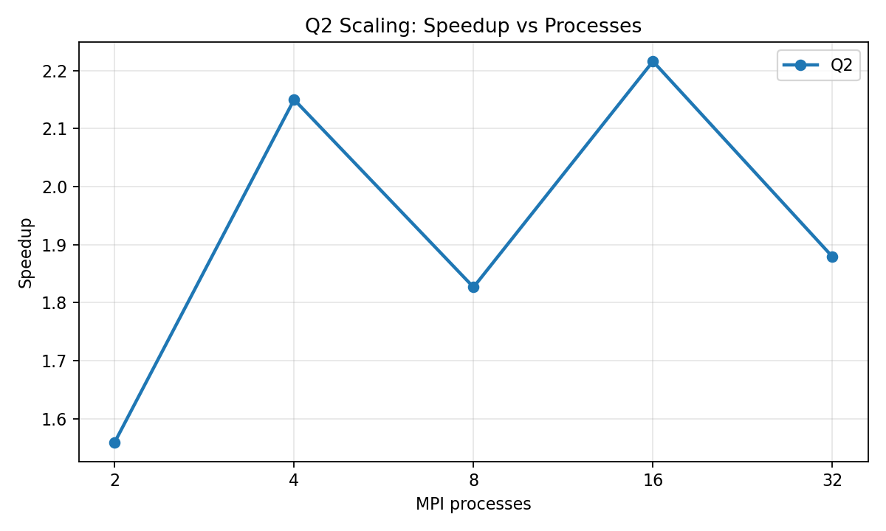
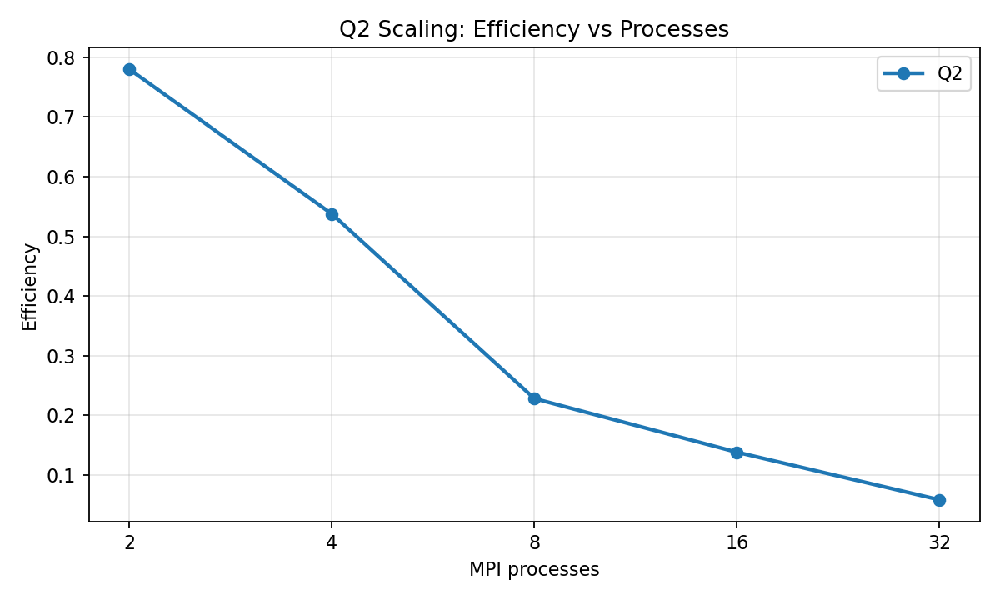
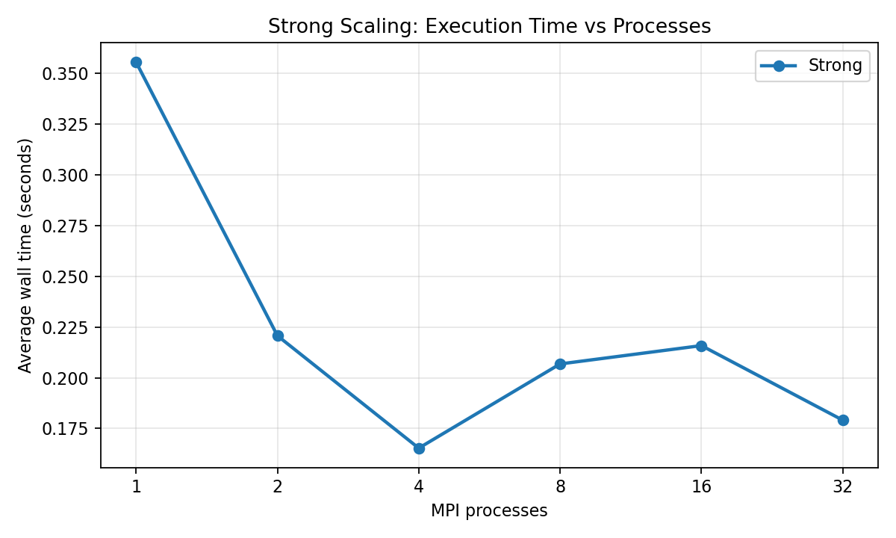
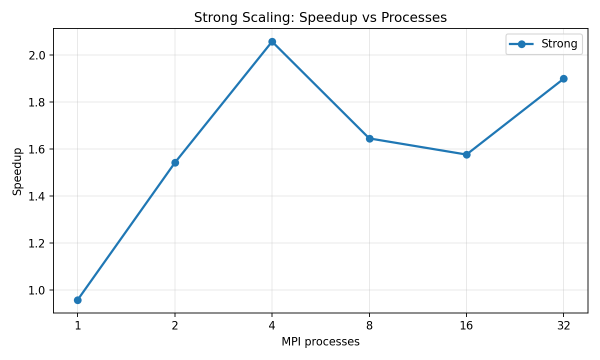
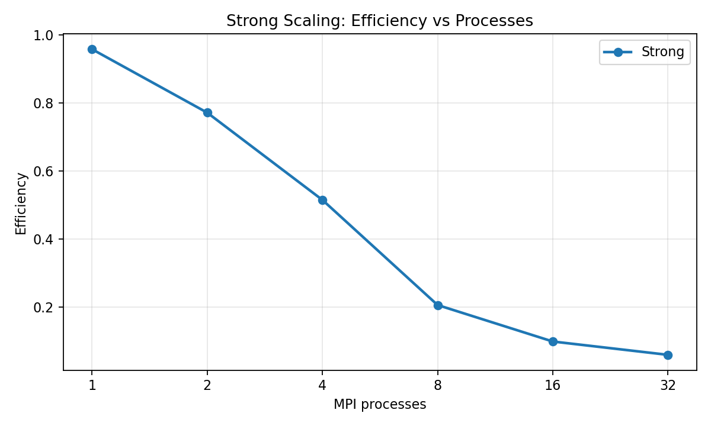
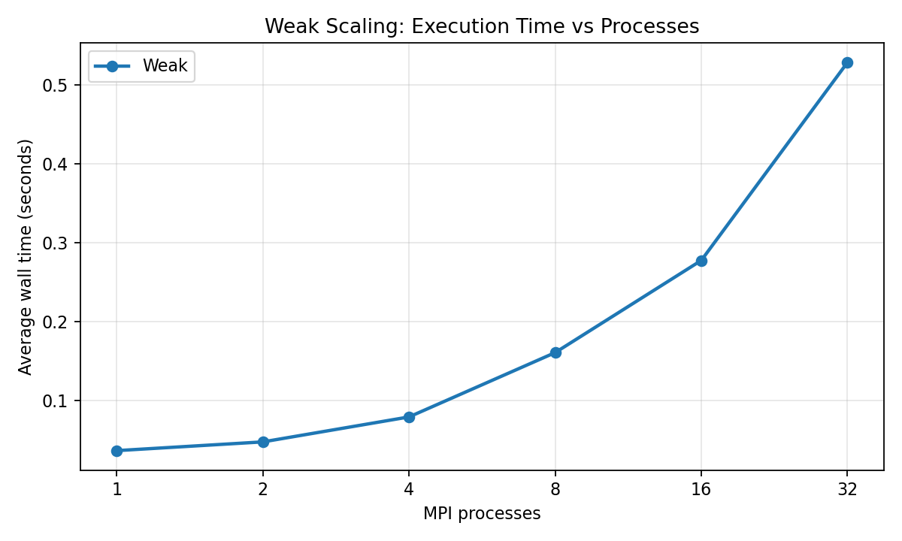
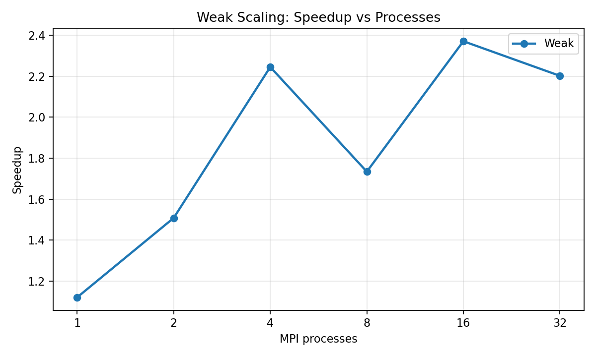
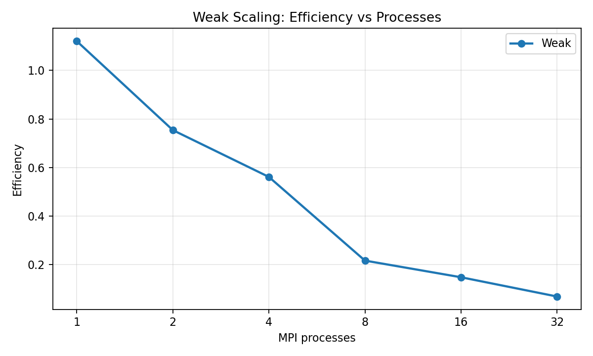

# Lab Activity 2 Report

This report satisfies the Lab 2 requirements for:

- Section 1: Question 1 (Sequential Baseline and Execution Profiling)
- Section 2: Question 2 (MPI Parallel Implementation)
- Section 3: Question 3 (Scalability and Performance Analysis)

## Environment

Hardware:

- CPU: Apple M1
- Cores/Threads: 8/8
- RAM: 8 GB
- OS: macOS 26.3

Software / methodology:

- Sequential compiler: `clang++`
- MPI compiler: `mpicc`
- MPI runner: `mpirun`
- Sequential timing: `std::chrono::steady_clock`
- MPI timing: `MPI_Wtime()`
- Runs per configuration: 3, average reported

Note: this machine has 8 CPU cores. Runs with 16 and 32 MPI processes oversubscribe the CPU, so those configurations are useful for observing overhead but are not expected to scale ideally.

---

## Section 1: Question 1 (Sequential Baseline)

### Goal

The sequential program provides the baseline used to evaluate MPI speedup and efficiency.

### Build And Run

```bash
clang++ -O2 -std=c++17 q2sequential.cpp -o build/q2sequential
./build/q2sequential 10000000
```

Automated run:

```bash
python3 script.py q1
```

### Algorithm

For each input value `x`, the program computes:

$$
y = \frac{\sin(x)^{\cos(x)} + \cos(x)^{\sin(x)}}{2}
$$

Values below `0.707` are counted as zero-class values. Remaining values are counted as one-class values.

### Results

Summary data is stored in `q1_summary.csv`. Raw measurements are stored in `q1_raw_timings.csv`.

| n | alloc avg (s) | conversion avg (s) | total avg (s) | zeros | ones |
|---:|---:|---:|---:|---:|---:|
| 1,000,000 | 0.009092 | 0.031608 | 0.040700 | 431,683 | 568,317 |
| 2,000,000 | 0.015616 | 0.055882 | 0.071498 | 862,456 | 1,137,544 |
| 4,000,000 | 0.036154 | 0.141336 | 0.177490 | 1,726,323 | 2,273,677 |
| 5,000,000 | 0.037623 | 0.131110 | 0.168733 | 2,158,753 | 2,841,247 |
| 8,000,000 | 0.062179 | 0.216376 | 0.278555 | 3,455,402 | 4,544,598 |
| 10,000,000 | 0.075754 | 0.264489 | 0.340243 | 4,319,287 | 5,680,713 |
| 16,000,000 | 0.146275 | 0.511740 | 0.658014 | 6,911,640 | 9,088,360 |
| 32,000,000 | 0.282360 | 0.881449 | 1.163809 | 13,822,447 | 18,177,553 |
| 50,000,000 | 0.377393 | 1.321248 | 1.698641 | 21,595,182 | 28,404,818 |

### Visualization



### Discussion

- The sequential version is required because speedup is measured relative to a single-process baseline.
- Runtime increases as input size increases because every element is initialized, transformed, and counted.
- The baseline also shows the limit of parallel improvement because MPI adds communication, synchronization, and process-management overhead.

---

## Section 2: Question 2 (MPI Parallel Implementation)

### Goal

The MPI version parallelizes the same discretization and counting algorithm using distributed-memory processes.

### Build And Run

```bash
mpicc -O2 q2parallel.c -lm -o build/q2parallel
mpirun -np 4 build/q2parallel 10000000
```

Automated run:

```bash
python3 script.py q2 --processes 2,4,8,16,32 --fixed-n 10000000 --mpi-extra "--oversubscribe"
```

### MPI Design

| Operation | Role |
|---|---|
| `MPI_Scatter` | Split the input array into equal chunks |
| Local computation | Each rank discretizes and counts its assigned chunk |
| `MPI_Reduce` | Sum local zero counts into a global zero count |
| `MPI_Gather` | Collect local computation times for reporting |
| `MPI_Wtime` | Measure wall-clock runtime |

### Process Responsibilities

- Rank 0 allocates and initializes the full input array.
- All ranks receive a chunk using `MPI_Scatter`.
- All ranks compute only on their local chunk.
- All ranks participate in `MPI_Reduce` to produce the final global count.
- Rank 0 prints the final result and timing information.

### Results

Summary data is stored in `q2_summary.csv`. Raw measurements are stored in `q2_raw_timings.csv`.

| n | processes | wall avg (s) | seq baseline (s) | speedup | efficiency |
|---:|---:|---:|---:|---:|---:|
| 10,000,000 | 2 | 0.218222 | 0.340243 | 1.5592 | 0.7796 |
| 10,000,000 | 4 | 0.158267 | 0.340243 | 2.1498 | 0.5375 |
| 10,000,000 | 8 | 0.186285 | 0.340243 | 1.8265 | 0.2283 |
| 10,000,000 | 16 | 0.153558 | 0.340243 | 2.2157 | 0.1385 |
| 10,000,000 | 32 | 0.181073 | 0.340243 | 1.8790 | 0.0587 |

### Visualizations







### Performance Observation

- The lowest Q2 wall time was at 16 processes: 0.153558 seconds.
- More processes reduce local computation size, but communication overhead prevents perfect scaling.
- `MPI_Scatter` adds distribution cost before computation.
- `MPI_Reduce` adds synchronization cost after computation.
- Oversubscribed configurations may slow down because multiple MPI ranks compete for the same CPU cores.

Observed degradation cases:

- 8 processes was slower than 4 processes (0.186285s vs 0.158267s).
- 32 processes was slower than 16 processes (0.181073s vs 0.153558s).

---

## Section 3: Question 3 (Scalability and Performance Analysis)

### Metrics

$$
Speedup(p) = \frac{T_s}{T_p}
$$

$$
Efficiency(p) = \frac{Speedup(p)}{p}
$$

Variables:

- `T_s`: sequential baseline time for the same problem size
- `T_p`: MPI wall-clock time with `p` processes
- `p`: number of MPI processes

### Strong Scaling

Strong scaling keeps total problem size fixed while increasing process count.

Summary data is stored in `q3_strong_summary.csv`. Raw measurements are stored in `q3_strong_raw_timings.csv`.

| n | processes | wall avg (s) | speedup | efficiency |
|---:|---:|---:|---:|---:|
| 10,000,000 | 1 | 0.355451 | 0.9572 | 0.9572 |
| 10,000,000 | 2 | 0.220705 | 1.5416 | 0.7708 |
| 10,000,000 | 4 | 0.165345 | 2.0578 | 0.5144 |
| 10,000,000 | 8 | 0.206811 | 1.6452 | 0.2056 |
| 10,000,000 | 16 | 0.215841 | 1.5764 | 0.0985 |
| 10,000,000 | 32 | 0.179126 | 1.8995 | 0.0594 |







Strong-scaling observations:

- The lowest strong-scaling wall time was at 4 processes: 0.165345 seconds.
- Increasing process count reduces per-rank work, but scatter/reduce costs and oversubscription eventually dominate.
- Efficiency tends to decrease as process count increases because overhead grows relative to local computation.

Observed strong-scaling degradation cases:

- 8 processes was slower than 4 processes (0.206811s vs 0.165345s).
- 16 processes was slower than 8 processes (0.215841s vs 0.206811s).

### Weak Scaling

Weak scaling increases total problem size proportionally with process count.

Summary data is stored in `q3_weak_summary.csv`. Raw measurements are stored in `q3_weak_raw_timings.csv`.

| n | processes | wall avg (s) | speedup | efficiency |
|---:|---:|---:|---:|---:|
| 1,000,000 | 1 | 0.036329 | 1.1203 | 1.1203 |
| 2,000,000 | 2 | 0.047415 | 1.5079 | 0.7540 |
| 4,000,000 | 4 | 0.079074 | 2.2446 | 0.5611 |
| 8,000,000 | 8 | 0.160653 | 1.7339 | 0.2167 |
| 16,000,000 | 16 | 0.277597 | 2.3704 | 0.1482 |
| 32,000,000 | 32 | 0.528654 | 2.2015 | 0.0688 |







Weak-scaling observations:

- The lowest weak-scaling wall time was at 1 processes: 0.036329 seconds.
- The per-process workload is approximately constant, so ideal weak scaling would keep wall time nearly flat.
- Growth in wall time indicates communication, synchronization, memory pressure, or oversubscription overhead.

Observed weak-scaling degradation cases:

- 2 processes was slower than 1 processes (0.047415s vs 0.036329s).
- 4 processes was slower than 2 processes (0.079074s vs 0.047415s).
- 8 processes was slower than 4 processes (0.160653s vs 0.079074s).
- 16 processes was slower than 8 processes (0.277597s vs 0.160653s).
- 32 processes was slower than 16 processes (0.528654s vs 0.277597s).

### Communication Behavior Analysis

- Increasing process count does not always reduce execution time because communication and synchronization overhead grow.
- `MPI_Scatter` introduces overhead by distributing the input from rank 0 to all ranks.
- `MPI_Reduce` introduces synchronization because all local counts must be combined.
- Performance eventually saturates when communication overhead, memory bandwidth, and CPU oversubscription dominate.

### Optimal Configuration

- Q2 fixed-size run: The lowest Q2 wall time was at 16 processes: 0.153558 seconds.
- Strong scaling: The lowest strong-scaling wall time was at 4 processes: 0.165345 seconds.
- Weak scaling: The lowest weak-scaling wall time was at 1 processes: 0.036329 seconds.

The balance point is the process count where adding more processes no longer provides meaningful wall-time improvement. On this machine, that point is strongly affected by the 8-core hardware limit.

## Files Submitted

- `q2sequential.cpp`
- `q2parallel.c`
- `script.py`
- `q1_raw_timings.csv`
- `q1_summary.csv`
- `q2_raw_timings.csv`
- `q2_summary.csv`
- `q3_strong_raw_timings.csv`
- `q3_strong_summary.csv`
- `q3_weak_raw_timings.csv`
- `q3_weak_summary.csv`
- `figures/`
- `REPORT.md`
- `REPORT.pdf`
