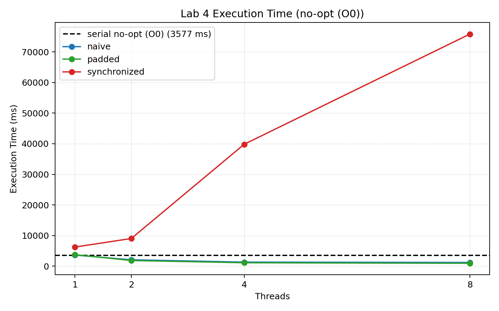
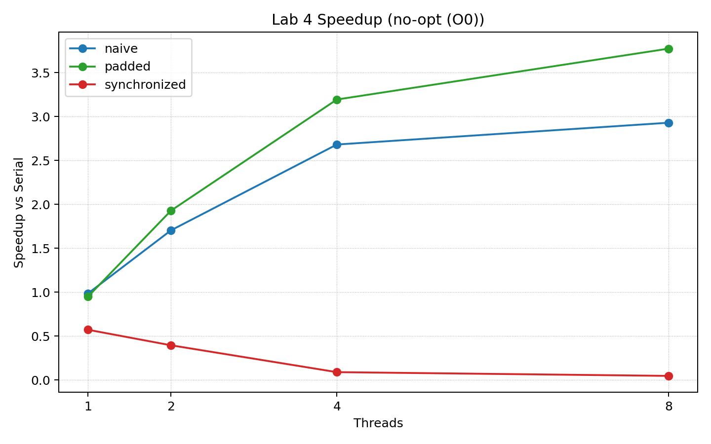
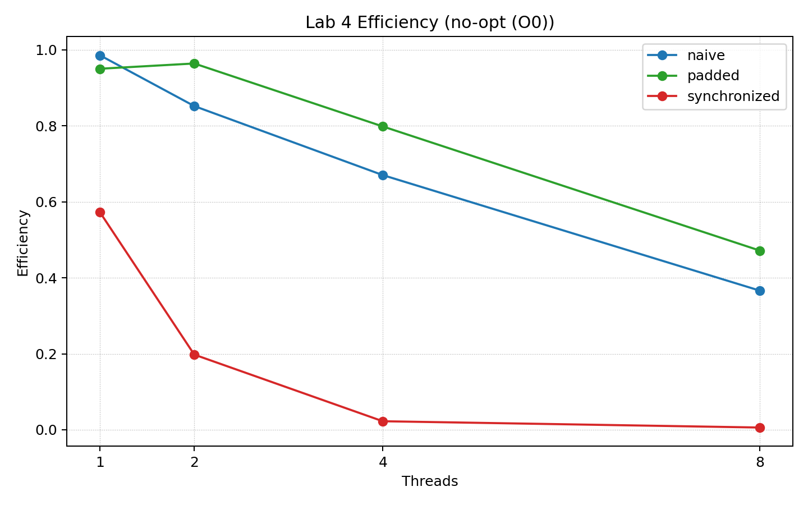
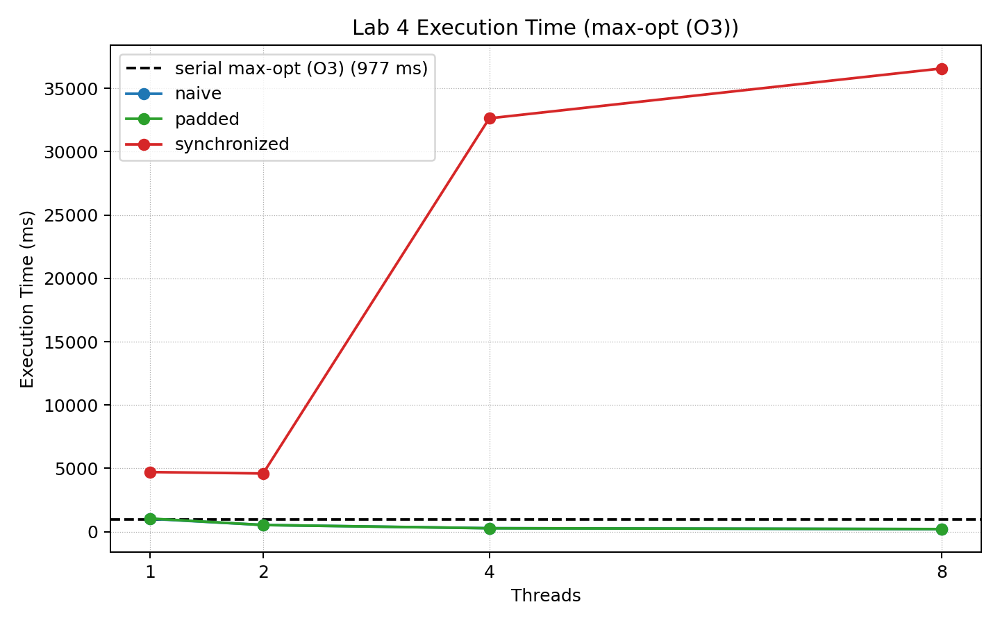
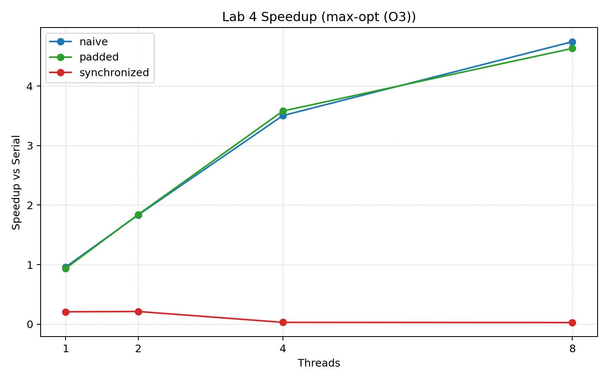
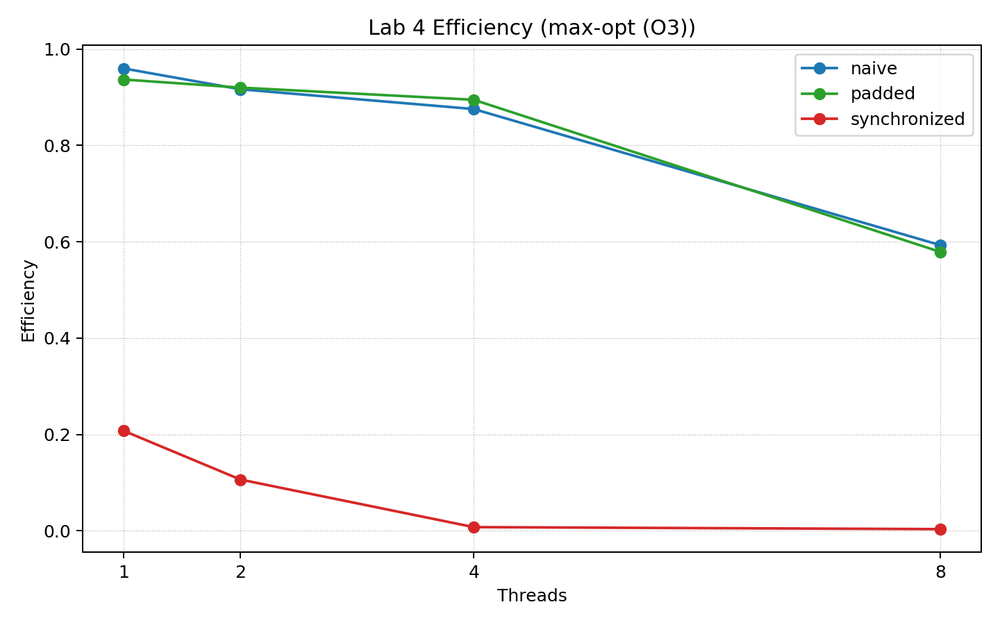

# Lab Activity 4 Report

This report satisfies the Lab 4 requirements for:

- Question 1: Parallel Approximation of $\pi$ Using OpenMP

## Environment

Hardware:

- Chip: Apple M1
- Cores/Threads: 8/8
- RAM: 8 GB
- OS: macOS 26.5.1

Software / methodology:

- Serial compiler: `clang++`
- OpenMP compiler: `clang++`
- OpenMP runtime: `libomp`
- Timing method: `std::chrono::steady_clock`
- Plotting: `matplotlib`
- Input size: `n = 1000000000`
- Thread counts tested: `1, 2, 4, 8`
- Runs per configuration: 1 measured run reported

Note: this machine has 8 logical CPU threads, so the `8`-thread configurations fully utilize the available hardware without oversubscription.

---

## Section 1: Question 1 (Parallel Approximation of $\pi$ Using OpenMP)

### Goal

The goal of this lab is to parallelize the numerical integration program for approximating $\pi$, compare three OpenMP accumulation strategies, and evaluate the impact of compiler optimization, synchronization, and false sharing.

### Build And Run

In this report, `-O0` is the required `no-opt` build and `-O3` is the required `max-opt` build.

```bash
mkdir -p build

clang++ pi_serial.cpp -O0 -o build/pi_serial_O0
clang++ pi_serial.cpp -O3 -o build/pi_serial_O3

clang++ -Xpreprocessor -fopenmp pi_naive.cpp \
  -I/opt/homebrew/opt/libomp/include \
  -L/opt/homebrew/opt/libomp/lib \
  -Wl,-rpath,/opt/homebrew/opt/libomp/lib \
  -lomp -O0 -o build/pi_naive_O0

clang++ -Xpreprocessor -fopenmp pi_naive.cpp \
  -I/opt/homebrew/opt/libomp/include \
  -L/opt/homebrew/opt/libomp/lib \
  -Wl,-rpath,/opt/homebrew/opt/libomp/lib \
  -lomp -O3 -o build/pi_naive_O3

clang++ -Xpreprocessor -fopenmp pi_padded.cpp \
  -I/opt/homebrew/opt/libomp/include \
  -L/opt/homebrew/opt/libomp/lib \
  -Wl,-rpath,/opt/homebrew/opt/libomp/lib \
  -lomp -O0 -o build/pi_padded_O0

clang++ -Xpreprocessor -fopenmp pi_padded.cpp \
  -I/opt/homebrew/opt/libomp/include \
  -L/opt/homebrew/opt/libomp/lib \
  -Wl,-rpath,/opt/homebrew/opt/libomp/lib \
  -lomp -O3 -o build/pi_padded_O3

clang++ -Xpreprocessor -fopenmp pi_synchronized.cpp \
  -I/opt/homebrew/opt/libomp/include \
  -L/opt/homebrew/opt/libomp/lib \
  -Wl,-rpath,/opt/homebrew/opt/libomp/lib \
  -lomp -O0 -o build/pi_synchronized_O0

clang++ -Xpreprocessor -fopenmp pi_synchronized.cpp \
  -I/opt/homebrew/opt/libomp/include \
  -L/opt/homebrew/opt/libomp/lib \
  -Wl,-rpath,/opt/homebrew/opt/libomp/lib \
  -lomp -O3 -o build/pi_synchronized_O3

OMP_NUM_THREADS=4 build/pi_padded_O3 1000000000
python3 plot_timings.py
```

### Parallelizable Loop

The loop in `pi_serial.cpp` that can be parallelized is:

```cpp
for (int i = 0; i < n; ++i) {
    x = ((double)i + 0.5) * stepSize;
    sum += 1.0 / (1.0 + x * x);
}
```

Each iteration computes one rectangle contribution to the numerical integral. Iteration `i` does not depend on iteration `i - 1`, so the loop iterations can execute independently. The only shared-data concern is the accumulation variable `sum`, which would produce a race condition if multiple threads updated it unsafely at the same time.

### OpenMP Design

| Implementation | Design |
|---|---|
| Serial baseline | Single-threaded loop used as the reference time for speedup |
| Naive | Each thread updates its own element in a shared array with adjacent memory locations |
| Padded | Each thread updates a padded slot in a shared array to reduce false sharing |
| Synchronized | All threads update one shared `sum` using `#pragma omp atomic` |

### Metrics

$$
Speedup(p) = \frac{T_s}{T_p}
$$

$$
Efficiency(p) = \frac{Speedup(p)}{p}
$$

Variables:

- `T_s`: serial baseline time for the same optimization level (`no-opt` / `-O0` or `max-opt` / `-O3`)
- `T_p`: OpenMP execution time with `p` threads
- `p`: number of OpenMP threads

### Results

Summary data is stored in `timing_data.csv`.

#### Serial Baseline

| Optimization | Threads | Time (ms) | pi(calculated) |
|---:|---:|---:|---:|
| no-opt (O0) | 1 | 3577 | 3.141592653589971 |
| max-opt (O3) | 1 | 977 | 3.141592653589971 |

#### OpenMP Results: no-opt (O0)

| Implementation | Threads | Time (ms) | Speedup | Efficiency |
|---|---:|---:|---:|---:|
| Naive | 1 | 3629 | 0.9857 | 0.9857 |
| Naive | 2 | 2099 | 1.7041 | 0.8521 |
| Naive | 4 | 1334 | 2.6814 | 0.6704 |
| Naive | 8 | 1221 | 2.9296 | 0.3662 |
| Padded | 1 | 3764 | 0.9503 | 0.9503 |
| Padded | 2 | 1855 | 1.9283 | 0.9642 |
| Padded | 4 | 1120 | 3.1938 | 0.7984 |
| Padded | 8 | 948 | 3.7732 | 0.4717 |
| Synchronized | 1 | 6250 | 0.5723 | 0.5723 |
| Synchronized | 2 | 9040 | 0.3957 | 0.1978 |
| Synchronized | 4 | 39812 | 0.0898 | 0.0225 |
| Synchronized | 8 | 75812 | 0.0472 | 0.0059 |

#### Visualizations: no-opt (O0)

{ width=95% }

{ width=95% }

{ width=95% }

#### OpenMP Results: max-opt (O3)

| Implementation | Threads | Time (ms) | Speedup | Efficiency |
|---|---:|---:|---:|---:|
| Naive | 1 | 1018 | 0.9597 | 0.9597 |
| Naive | 2 | 533 | 1.8330 | 0.9165 |
| Naive | 4 | 279 | 3.5018 | 0.8754 |
| Naive | 8 | 206 | 4.7427 | 0.5928 |
| Padded | 1 | 1043 | 0.9367 | 0.9367 |
| Padded | 2 | 531 | 1.8399 | 0.9200 |
| Padded | 4 | 273 | 3.5788 | 0.8947 |
| Padded | 8 | 211 | 4.6303 | 0.5788 |
| Synchronized | 1 | 4711 | 0.2074 | 0.2074 |
| Synchronized | 2 | 4597 | 0.2125 | 0.1063 |
| Synchronized | 4 | 32628 | 0.0299 | 0.0075 |
| Synchronized | 8 | 36564 | 0.0267 | 0.0033 |

#### Visualizations: max-opt (O3)

{ width=95% }

{ width=95% }

{ width=95% }

### Accuracy Observation

All implementations produced values very close to the exact value of $\pi$. The largest absolute difference from the exact value across all runs was approximately `2.96e-13`. The small differences between runs come from floating-point addition order, especially when the accumulation order changes across threads.

### Performance Observation

- The serial `max-opt (O3)` baseline (`977 ms`) was about `3.66x` faster than the serial `no-opt (O0)` baseline (`3577 ms`).
- The best `no-opt (O0)` result was the padded version with `8` threads at `948 ms`.
- The best `max-opt (O3)` result was the naive version with `8` threads at `206 ms`.
- The synchronized version was the worst performer for both optimization levels because the shared atomic accumulator became a severe bottleneck.

Observed false-sharing benefit:

- For `no-opt (O0)`, padded outperformed naive at `2`, `4`, and `8` threads (`1855 ms` vs `2099 ms`, `1120 ms` vs `1334 ms`, and `948 ms` vs `1221 ms`).
- For `max-opt (O3)`, padded slightly outperformed naive at `2` and `4` threads, but naive was slightly faster at `8` threads (`206 ms` vs `211 ms`).

Observed synchronization degradation:

- In `no-opt (O0)`, synchronized became slower as threads increased from `1` to `8` (`6250 ms` to `75812 ms`).
- In `max-opt (O3)`, synchronized remained far slower than the other implementations and also degraded badly at `4` and `8` threads.

### Discussion

#### Effect of Compiler Optimization

Compiler optimization had a major impact on performance. Even before parallelization, the serial `max-opt (O3)` binary was much faster than the serial `no-opt (O0)` binary. The same trend appeared in the OpenMP implementations, where the `max-opt` binaries consistently outperformed the corresponding `no-opt` versions.

#### Effect of False Sharing

The padded implementation was designed to reduce false sharing by separating per-thread accumulators in memory. The `no-opt (O0)` data shows a clear benefit from padding at higher thread counts. This indicates that cache-line interference affected the naive shared-array layout. Under `max-opt (O3)`, the difference between naive and padded became smaller, which suggests that compiler optimization and hardware behavior reduced the visible penalty.

#### Effect of Synchronization

The synchronized implementation used an atomic update on every loop iteration. This guarantees correctness, but it forces all threads to serialize on the same shared variable. The resulting contention was severe enough to eliminate speedup entirely and produce dramatic slowdowns at larger thread counts.

#### Scaling Behavior

The naive and padded implementations both improved as thread count increased, but neither achieved perfect linear scaling. Efficiency decreased as more threads were used, which is expected because thread-management overhead, memory behavior, and contention all become more visible at higher parallelism levels.

### Optimal Configuration

- Best overall wall time: naive `max-opt (O3)` with `8` threads at `206 ms`
- Best `no-opt (O0)` wall time: padded `no-opt (O0)` with `8` threads at `948 ms`
- Best evidence of reduced false sharing: padded `no-opt (O0)` compared with naive `no-opt (O0)` at `4` and `8` threads
- Worst configuration: synchronized `no-opt (O0)` with `8` threads at `75812 ms`

The balance point on this machine was to use all `8` available threads with a per-thread partial-sum design rather than a synchronized shared accumulator.

## Files Submitted

- `pi_serial.cpp`
- `pi_naive.cpp`
- `pi_padded.cpp`
- `pi_synchronized.cpp`
- `timing_data.csv`
- `plot_timings.py`
- `figures/`
- `report-template.tex`
- `REPORT.md`
- `REPORT.pdf`
