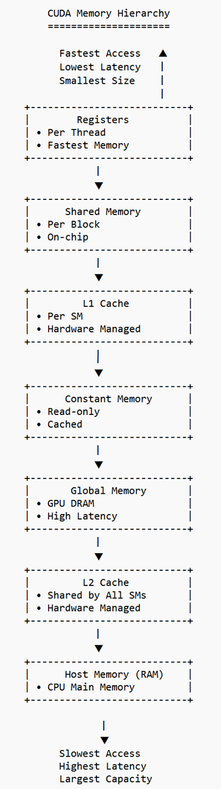

# DPS921 Parallel Algorithms and Programming Techniques

## Week 9 Lecture Materials: CUDA Memory and Optimization

**Course:** DPS921NAA.06369.2264  
**Topic:** Shared Memory and CUDA Performance  
**Instructor:** Jeevan Pant

---

## Agenda Topics

### CUDA Core

- CUDA Core

### 6.6 Memory Hierarchy

- 6.6.1 Local Memory / Registers
- 6.6.2 Shared Memory
- 6.6.3 Constant Memory  
  - Ignore texture/surface memory for introductory coverage.

### CUDA Optimization

- 6.7 Optimization Techniques
- 6.7.1 Block and Grid Design
- 6.7.2 Kernel Structure
- 6.7.3 Shared Memory Access
- 6.7.4 Global Memory Access
- 6.7.5 Asynchronous Execution and Streams
- 6.12 Debugging CUDA Programs
- 6.13 Profiling CUDA Programs

### Overview Only

- 6.8 CUDA Graphs
- 6.9 Warp Functions
- 6.10 Cooperative Groups
- 6.11 Dynamic Parallelism
- 6.14 CUDA and MPI

---

# CUDA Core

A **CUDA Core** is the basic processing unit inside an NVIDIA GPU that executes instructions for individual CUDA threads. It is designed for massive parallel processing, allowing thousands of threads to run simultaneously across many CUDA cores.

Unlike a CPU, which has a few powerful cores optimized for sequential tasks, a GPU contains hundreds or thousands of simpler CUDA cores optimized for performing the same operation on many pieces of data at once. This architecture makes GPUs highly effective for workloads such as:

- Image processing
- Scientific simulations
- Machine learning
- Video rendering

In CUDA programming, threads are organized into **warps of 32 threads**, and all threads within a warp execute the same instruction simultaneously using the **SIMT** model.

**SIMT** means **Single Instruction, Multiple Thread**.

The overall performance of a CUDA application depends not only on the number of CUDA cores, but also on factors such as:

- Efficient memory usage
- Thread organization
- Minimizing thread divergence

## Key Points

- A CUDA Core is the basic execution unit of an NVIDIA GPU.
- Each CUDA Core executes instructions for GPU threads.
- GPUs contain many CUDA cores to support massive parallelism.
- CUDA cores are optimized for high-throughput computation rather than complex sequential processing.
- Threads execute in groups called **warps**.
- One warp contains **32 threads**.
- CUDA uses the **SIMT** execution model.
- Performance depends on both the number of CUDA cores and how efficiently the program uses GPU resources.

---

# 6.6 Memory Hierarchy

The **CUDA memory hierarchy** is the organization of different types of memory available on an NVIDIA GPU.

Each memory type has different characteristics in terms of:

- Speed
- Size
- Scope
- Accessibility

Choosing the appropriate memory type is essential for achieving high performance in CUDA applications.

Memory closest to the GPU cores is the fastest but has limited capacity. Memory farther from the cores provides larger storage but higher access latency.

Efficient CUDA programs minimize accesses to slow global memory by making effective use of faster memory types such as:

- Registers
- Shared memory
- Constant memory

Understanding the CUDA memory hierarchy helps programmers:

- Optimize memory access patterns
- Reduce latency
- Improve overall kernel performance

## Key Points

- CUDA provides multiple memory types with different performance characteristics.
- Faster memory is smaller and located closer to the GPU cores.
- Slower memory is larger but has higher access latency.
- Proper memory selection is critical for maximizing GPU performance.
- The main memory types include:
  - Registers
  - Local memory
  - Shared memory
  - Constant memory
  - Global memory

## CUDA Memory Hierarchy Image

The original lecture material references the following image:



> Note: L1 and L2 caches are hardware-managed caches that automatically reduce the latency of global memory accesses. Unlike registers, shared memory, and constant memory, programmers generally do not explicitly manage these caches in introductory CUDA programming.

---

# 6.6.1 Local Memory / Registers

## Registers

**Registers** are the fastest memory available in CUDA. They are used to store variables that are private to each thread.

Registers are located directly on the **Streaming Multiprocessor (SM)**, allowing almost immediate access during kernel execution.

The CUDA compiler automatically assigns frequently used variables to registers whenever possible.

Because registers are limited in number, using too many variables within a kernel may exhaust the available registers. When this happens, the compiler stores some variables in local memory. This process is called **register spilling**, and it can significantly reduce performance.

## Example: Register Usage

In the following kernel, the scalar variables `a`, `b`, and `c` are small and frequently accessed. The CUDA compiler will typically allocate these variables in registers.

```cpp
__global__ void registerExample(int *output)
{
    int a = threadIdx.x;
    int b = a * 2;
    int c = b + 10;

    output[threadIdx.x] = c;
}
```

Each thread has its own private copy of these variables.

```text
Thread 0             Thread 1             Thread 2
---------            ---------            ---------
a = 0                a = 1                a = 2
b = 0                b = 2                b = 4
c = 10               c = 12               c = 14
```

Since these variables are small scalar values, they are typically stored in registers, providing the fastest possible access during kernel execution.

## Register Spilling

If a kernel requires more registers than are available, the compiler moves some variables into local memory.

```cpp
__global__ void spillingExample(float *out)
{
    float a0 = 0,  a1 = 1,  a2 = 2,  a3 = 3;
    float a4 = 4,  a5 = 5,  a6 = 6,  a7 = 7;
    float a8 = 8,  a9 = 9,  a10 = 10, a11 = 11;
    float a12 = 12, a13 = 13, a14 = 14, a15 = 15;

    out[threadIdx.x] = a0 + a15;
}
```

If too many variables are declared, the compiler may not have enough registers available. The excess variables are then stored in local memory, resulting in **register spilling**.

Register spilling increases memory access latency and can reduce kernel performance.

## Key Points: Registers

- Registers are the fastest memory in CUDA.
- Each register is private to a single thread.
- Registers are allocated automatically by the compiler.
- Limited register availability can reduce kernel occupancy.
- Excessive register usage may cause register spilling into local memory.

---

## Local Memory

Despite its name, **local memory** is not physically located close to the GPU cores. Instead, it resides in global memory but is logically private to each thread.

Local memory is primarily used when:

- There are not enough registers to hold all thread variables.
- A thread uses large local arrays.

Since local memory has similar latency to global memory, accessing it is much slower than accessing registers. Therefore, CUDA programmers should minimize local memory usage whenever possible to improve application performance.

## Example: Local Memory Usage

Large arrays declared inside a kernel usually cannot fit into registers. In such cases, the compiler stores them in local memory.

```cpp
__global__ void localMemoryExample(int *output)
{
    int temp[100];      // Typically allocated in local memory
    int tid = threadIdx.x;

    temp[tid] = tid * 10;
    output[tid] = temp[tid];
}
```

Here, each thread has its own private array.

```text
Thread 0                Thread 1
---------               ---------
temp[0]                 temp[0]
temp[1]                 temp[1]
...                     ...
temp[99]                temp[99]
```

Although every thread owns its own array, the array is stored in local memory, which is physically located in global memory. Consequently, accessing this array is significantly slower than accessing variables stored in registers.

## Checking Register Usage

The NVIDIA CUDA compiler can report register usage during compilation.

```bash
nvcc -Xptxas -v program.cu
```

Example output:

```text
ptxas info    : Used 12 registers
ptxas info    : 0 bytes spill stores
ptxas info    : 0 bytes spill loads
```

This indicates that the kernel uses 12 registers per thread and no variables were spilled into local memory.

If spilling occurs, the compiler may report:

```text
ptxas info    : Used 255 registers
ptxas info    : 64 bytes spill stores
ptxas info    : 64 bytes spill loads
```

This indicates that some variables were stored in local memory because the available registers were exhausted.

## Key Points: Local Memory

- Local memory is private to each thread.
- It is physically stored in global memory.
- It is used when registers are insufficient or when large local arrays are needed.
- It is much slower than registers due to higher memory latency.
- Minimizing local memory usage improves kernel performance.

## Comparison: Registers vs. Local Memory

| Feature | Registers | Local Memory |
|---|---|---|
| Ownership | Private to each thread | Private to each thread |
| Physical Location | On-chip, inside the Streaming Multiprocessor | Off-chip, in global memory |
| Access Speed | Fastest | Much slower |
| Managed By | CUDA compiler | CUDA compiler |
| Typical Usage | Scalar variables | Large arrays and register spilling |
| Performance | Very high | Lower due to high latency |

---

# 6.6.2 Shared Memory

**Shared memory** is a fast, on-chip memory that is shared among all threads within the same thread block.

It enables threads to cooperate by sharing intermediate data, making it much faster than repeatedly accessing global memory.

Shared memory is commonly used as a **programmer-managed cache**. Threads can load data from global memory into shared memory once, perform multiple computations using the shared data, and then write results back to global memory.

This significantly reduces expensive global memory accesses and improves overall kernel performance.

However, shared memory is limited in size, and its contents are only accessible by threads within the same block.

Proper synchronization using `__syncthreads()` is often required to ensure all threads have completed reading or writing shared memory before continuing execution.

Typical shared memory size is approximately **48 KB per Streaming Multiprocessor (SM)**, although the exact size varies depending on the GPU architecture.

## Example: Shared Memory Usage Concept

In this example:

1. Each thread reads one value from global memory.
2. The value is stored in shared memory.
3. `__syncthreads()` ensures all threads have completed the copy.
4. Each thread reads the value from shared memory and performs the computation.

Instead of repeatedly accessing slow global memory, the kernel reuses fast shared memory.

## Data Flow

```text
         Global Memory
              │
              ▼
+---------------------------+
| Shared Memory (Block)     |
|---------------------------|
|       sharedData[0]       |
|       sharedData[1]       |
|       sharedData[2]       |
|           ...             |
+---------------------------+
             ▲
             │
Threads within the same block
```

## Thread Cooperation

Unlike registers, which are private to individual threads, shared memory can be accessed by every thread in the block.

```text
                Thread Block

     Thread 0      Thread 1      Thread 2
         │             │             │
         └──────┬──────┴──────┬──────┘
                │             │
          +-------------------------+
          |     Shared Memory       |
          | sharedData[0]           |
          | sharedData[1]           |
          | sharedData[2]           |
          | ...                     |
          +-------------------------+
```

All threads within the block can read from and write to shared memory, allowing them to exchange intermediate results efficiently.

## Why `__syncthreads()` Is Needed

Suppose Thread 0 reads from shared memory before Thread 5 has written its value.

```text
Thread 0  ---> Reading sharedData[5]
Thread 5  ---> Still writing sharedData[5]
```

The result may be incorrect because the data is not yet available.

Using:

```cpp
__syncthreads();
```

forces every thread in the block to wait until all threads have completed their previous operations.

```text
      All Threads
           │
           ▼
    __syncthreads()
           │
           ▼
Continue Execution Together
```

This synchronization ensures that shared memory contains valid data before any thread uses it.

## Why Shared Memory Improves Performance

Without shared memory:

```text
Thread 0 ──► Global Memory
Thread 1 ──► Global Memory
Thread 2 ──► Global Memory
Thread 3 ──► Global Memory

Many slow global memory accesses
```

With shared memory:

```text
Global Memory
      │
      ▼
  Load Once
      │
      ▼
Shared Memory
      │
      ▼
  Thread 0
  Thread 1
  Thread 2
  Thread 3

Many fast accesses
```

Since shared memory resides on the Streaming Multiprocessor (SM), its access latency is much lower than that of global memory.

## Example: Using Shared Memory

```cpp
#include <iostream>
#define N 8

__global__ void sharedMemoryExample(int *A, int *B, int *C)
{
    // Shared memory for this block
    __shared__ int sA[N];
    __shared__ int sB[N];

    int tid = threadIdx.x;

    // Step 1: Load data from global memory
    sA[tid] = A[tid];
    sB[tid] = B[tid];

    // Step 2: Wait until all threads finish loading
    __syncthreads();

    // Step 3: Perform computation using shared memory
    C[tid] = sA[tid] + sB[tid];
}

int main()
{
    int h_A[N] = {1,2,3,4,5,6,7,8};
    int h_B[N] = {10,20,30,40,50,60,70,80};
    int h_C[N];

    int *d_A, *d_B, *d_C;

    cudaMalloc(&d_A, N * sizeof(int));
    cudaMalloc(&d_B, N * sizeof(int));
    cudaMalloc(&d_C, N * sizeof(int));

    cudaMemcpy(d_A, h_A, N * sizeof(int), cudaMemcpyHostToDevice);
    cudaMemcpy(d_B, h_B, N * sizeof(int), cudaMemcpyHostToDevice);

    sharedMemoryExample<<<1, N>>>(d_A, d_B, d_C);

    cudaMemcpy(h_C, d_C, N * sizeof(int), cudaMemcpyDeviceToHost);

    for (int i = 0; i < N; i++)
        std::cout << h_C[i] << " ";

    cudaFree(d_A);
    cudaFree(d_B);
    cudaFree(d_C);

    return 0;
}
```

## Typical Applications

Shared memory is widely used in applications where data is reused multiple times, such as:

- Matrix multiplication
- Image processing
- Convolution filters
- Reduction operations, such as sum, maximum, and minimum
- Prefix scan algorithms

## Key Points

- Shared memory is shared among threads within the same block.
- It is located on-chip, providing very low access latency.
- It is faster than global memory but limited in size.
- It acts as a programmer-managed cache to reduce global memory accesses.
- It is frequently used when data must be reused by multiple threads.
- It requires thread synchronization using `__syncthreads()` when multiple threads access shared data.
- Typical size is approximately 48 KB per Streaming Multiprocessor (SM), but this varies by GPU architecture.

## Comparison: Registers, Shared Memory, and Global Memory

| Feature | Registers | Shared Memory | Global Memory |
|---|---|---|---|
| Scope | One thread | One thread block | All threads |
| Physical Location | On-chip, inside the SM | On-chip, inside the SM | Off-chip, in GPU DRAM |
| Access Speed | Fastest | Very fast | Slow |
| Size | Very small | Small, around 48 KB/SM depending on GPU | Very large |
| Managed By | Compiler | Programmer | Programmer |
| Typical Use | Scalar variables | Shared data and caching | Large datasets |

---

# 6.6.3 Constant Memory

**Constant memory** is a small, read-only memory space in CUDA used to store data that remains unchanged during kernel execution.

It is optimized for scenarios where many threads read the same value at the same time, allowing the GPU to broadcast the value efficiently to all threads.

Constant memory is cached, so repeated accesses to the same location are much faster than global memory.

It is commonly used for:

- Mathematical constants
- Configuration parameters
- Filter coefficients
- Small lookup tables

However, constant memory is only efficient when all threads in a warp access the same address. If different threads access different addresses, performance degrades because accesses become serialized.

## Key Points

- Constant memory is read-only during kernel execution.
- It is cached to provide faster access than global memory.
- It is best suited for values shared by all threads.
- It is commonly used for constants, lookup tables, and configuration parameters.
- It is most efficient when all threads access the same memory location simultaneously.

## Example 1: Basic Constant Memory Usage

This example shows the ideal use case where all threads read the same constant value.

```cpp
#include <iostream>
#define N 8

// Declare constant memory on GPU
__constant__ float d_constantValue;

__global__ void constantMemoryExample(float *output)
{
    int tid = threadIdx.x;

    // All threads read the same constant value
    output[tid] = d_constantValue * tid;
}

int main()
{
    float h_constant = 3.0f;
    float h_output[N];
    float *d_output;

    cudaMalloc(&d_output, N * sizeof(float));

    // Copy value from host to constant memory
    cudaMemcpyToSymbol(d_constantValue, &h_constant, sizeof(float));

    constantMemoryExample<<<1, N>>>(d_output);

    cudaMemcpy(h_output, d_output, N * sizeof(float), cudaMemcpyDeviceToHost);

    for (int i = 0; i < N; i++)
        std::cout << h_output[i] << " ";

    std::cout << "\n";

    cudaFree(d_output);
    return 0;
}
```

Here, access to `d_constantValue` is fast because the GPU fetches it once and broadcasts it to all threads.

## Example 2: Constant Memory Array

This is a realistic use case for image processing or convolution.

```cpp
#include <iostream>

#define N 8
#define FILTER_SIZE 3

__constant__ float d_filter[FILTER_SIZE];

__global__ void convolutionExample(float *input, float *output)
{
    int tid = threadIdx.x;
    float result = 0;

    // Apply small filter from constant memory
    for (int i = 0; i < FILTER_SIZE; i++)
    {
        result += input[tid] * d_filter[i];
    }

    output[tid] = result;
}

int main()
{
    float h_input[N] = {1,2,3,4,5,6,7,8};
    float h_output[N];
    float h_filter[FILTER_SIZE] = {0.2f, 0.5f, 0.3f};

    float *d_input, *d_output;

    cudaMalloc(&d_input, N * sizeof(float));
    cudaMalloc(&d_output, N * sizeof(float));

    cudaMemcpy(d_input, h_input, N * sizeof(float), cudaMemcpyHostToDevice);

    // Copy filter into constant memory
    cudaMemcpyToSymbol(d_filter, h_filter, FILTER_SIZE * sizeof(float));

    convolutionExample<<<1, N>>>(d_input, d_output);

    cudaMemcpy(h_output, d_output, N * sizeof(float), cudaMemcpyDeviceToHost);

    for (int i = 0; i < N; i++)
        std::cout << h_output[i] << " ";

    std::cout << "\n";

    cudaFree(d_input);
    cudaFree(d_output);
    return 0;
}
```

In this code, filter values are fetched once, cached, and reused many times.

## Example 3: Inefficient Constant Memory Access

Constant memory becomes slow when threads diverge in their access pattern.

```cpp
__constant__ float d_values[8];

__global__ void badConstantAccess(float *out)
{
    int tid = threadIdx.x;

    // Bad: each thread accesses a different location
    out[tid] = d_values[tid] * 2;
}
```

Here, access is not broadcast. The GPU must serialize accesses, so performance drops significantly.

## Comparison: Constant Memory vs. Global Memory

| Feature | Constant Memory | Global Memory |
|---|---|---|
| Type | Read-only | Read/write |
| Speed | Fast when cached | Slow |
| Best Case | Same value for all threads | Any pattern |
| Worst Case | Divergent access | Random access |
| Size | Very small, around 64 KB | Very large |

---

# CUDA Optimization

CUDA optimization focuses on improving:

- GPU utilization
- Memory efficiency
- Parallel execution efficiency

The goal is to reduce latency and maximize throughput by designing kernels and memory access patterns carefully.

CUDA optimization is less about memorizing complex syntax and more about understanding the hardware layout of the GPU.

Because GPUs are throughput-oriented rather than latency-oriented devices, your goal shifts from:

> How do I make this one thread run faster?

To:

> How do I stop thousands of threads from waiting on each other?

---

# 6.7 Optimization Techniques

CUDA optimization is about making full use of GPU hardware by improving:

- Efficient thread usage
- Memory access reduction
- Avoiding warp divergence
- Overlapping computation and data transfer

A good CUDA program is not just parallel. It is **hardware-aware parallel code**.

---

# 6.7.1 Block and Grid Design

Block and grid configuration directly affect parallel performance and occupancy.

It is the art of structuring parallel threads so that they map well to the data and efficiently use GPU hardware.

## Key Concepts

| Concept | Meaning | Analogy |
|---|---|---|
| Grid | Collection of thread blocks | Entire factory |
| Block | Group of threads, typically 128 to 1024 threads | Individual work department |
| Thread | Smallest execution unit | Worker |
| Warp | Group of 32 threads | Team of workers executing together |

A single thread executes a single instance of your kernel code.

## Why Block/Grid Design Matters

Bad configuration can lead to:

- Idle GPU cores
- Poor occupancy
- Wasted memory bandwidth

## Example: Vector Addition

```cpp
__global__ void vectorAdd(int *A, int *B, int *C, int N)
{
    int idx = blockIdx.x * blockDim.x + threadIdx.x;

    if (idx < N)
        C[idx] = A[idx] + B[idx];
}
```

Launch configuration:

```cpp
int blockSize = 256;
int gridSize = (N + blockSize - 1) / blockSize;

vectorAdd<<<gridSize, blockSize>>>(A, B, C, N);
```

## Optimization Guidelines

- Choose block size as a multiple of 32, because the warp size is 32.
- Common good values are 128, 256, and 512 threads per block.
- Ensure there are enough blocks to keep the GPU fully occupied.
- Avoid too few blocks, which causes underutilization.
- Avoid too many small blocks, which causes scheduling overhead.

## Rule of Thumb

Keep the GPU always busy by having more blocks than Streaming Multiprocessors.

This is one of the core strategies for achieving high performance on modern GPUs.

---

# 6.7.2 Kernel Structure

Kernel design defines how efficiently each thread computes work.

## Good Kernel Design Principles

- Maximize parallel work per thread.
- Minimize branching with `if`/`else`.
- Avoid warp divergence.
- Keep computation simple inside the kernel.
- Reduce redundant calculations.

## Bad Pattern

```cpp
if (threadIdx.x % 2 == 0)
    doHeavyWork();
else
    doCompletelyDifferentWork();
```

This causes warp divergence because threads in the same warp are doing different work.

Warp divergence can be caused by:

- Heavy branching inside loops
- Threads doing very different tasks

## Good Pattern

```cpp
__global__ void kernel(int *data)
{
    int idx = threadIdx.x;

    int x = data[idx];
    x = x * 2 + 5;   // uniform computation

    data[idx] = x;
}
```

## Optimization Strategies

- Move invariant computations outside loops.
- Precompute repeated expressions.
- Use inline functions for small operations.
- Reduce register pressure by avoiding too many variables.

---

# 6.7.3 Shared Memory Access

Shared memory is a software-controlled cache inside GPU Streaming Multiprocessors.

## Why Shared Memory?

- It is much faster than global memory.
- It enables data reuse inside thread blocks.
- It reduces memory traffic.

## Example: Matrix Tile Concept

```cpp
__global__ void simpleShared(int *A, int *B, int *C)
{
    __shared__ int tile[256];

    int tid = threadIdx.x;

    tile[tid] = A[tid];   // load from global memory to shared memory
    __syncthreads();

    C[tid] = tile[tid] * 2;
}
```

## Key Idea

Instead of this:

```text
Global memory read (slow) × many times
```

We do this:

```text
Global memory read once
        ↓
Shared memory reuse (fast)
```

## Optimization Techniques

- Load data from global memory once.
- Reuse data multiple times in shared memory.
- Use tiling, especially for matrix operations.
- Minimize global memory access.

## Important Concept: Bank Conflicts

Shared memory is divided into banks.

Performance drops when multiple threads access the same memory bank simultaneously.

## Rule

Structure data to ensure parallel, conflict-free access. Arrange memory so threads access different banks.

## Common Use Cases

- Matrix multiplication
- Convolution
- Image filtering
- Reduction, such as sum or maximum

---

# 6.7.4 Global Memory Access

Global memory is usually the slowest frequently used memory, but it is also the largest memory. Therefore, global memory optimization is critical.

## Key Problem

Global memory has high latency, approximately 100 to 300 cycles, so it must be optimized carefully.

## Most Important Optimization: Coalescing

### Good: Coalesced Access

```text
thread 0 → data[0]
thread 1 → data[1]
thread 2 → data[2]
thread 3 → data[3]
```

### Bad: Uncoalesced Access

```text
thread 0 → data[0]
thread 1 → data[10]
thread 2 → data[20]
```

## Example

```cpp
__global__ void coalesced(int *data)
{
    int idx = threadIdx.x + blockIdx.x * blockDim.x;
    data[idx] = data[idx] * 2;
}
```

## Optimization Techniques

- Use sequential indexing.
- Align data structures.
- Avoid strided access.
- Use shared memory as a cache.
- Reduce memory transactions.

## Pattern

```text
Global Memory → Shared Memory → Registers → Compute
```

---

# 6.7.5 Asynchronous Execution and Streams

Streams allow parallel execution of GPU tasks.

## What Is a Stream?

A **stream** is a sequence of operations executed in order.

Example operations include:

- Memory copy
- Kernel execution
- Memory copy back

## Types of Streams

| Type | Description |
|---|---|
| Default stream | Usually behaves synchronously |
| User-defined streams | Can allow parallel execution |

## Example: Two Streams

```text
Stream 1: Copy → Kernel → Copy
Stream 2: Copy → Kernel → Copy
```

These can execute concurrently if hardware resources allow it.

## CUDA Streams Example

```cpp
cudaStream_t s1, s2;
cudaStreamCreate(&s1);
cudaStreamCreate(&s2);

kernel<<<grid, block, 0, s1>>>(A);
kernel<<<grid, block, 0, s2>>>(B);
```

---

# 6.8 CUDA Graphs: Overview

CUDA Graphs provide a way to represent a sequence of GPU operations, such as kernel launches and memory transfers, as a graph.

Instead of launching each operation individually from the CPU, the entire graph can be created once and executed repeatedly with lower overhead.

CUDA Graphs are particularly useful for applications that perform the same sequence of operations multiple times, such as:

- Deep learning
- Scientific simulations
- Image processing

By reducing CPU overhead and launch latency, CUDA Graphs can improve the overall performance of GPU applications.

## Key Points

- CUDA Graphs represent a sequence of GPU operations as a graph.
- They reduce CPU overhead associated with repeated kernel launches.
- They improve performance for repetitive workloads.
- They are useful in machine learning, simulations, and scientific computing.

---

# 6.9 Warp Functions: Overview

A **warp** is a group of 32 CUDA threads that execute the same instruction simultaneously using the SIMT execution model.

CUDA provides warp functions that allow threads within the same warp to communicate and exchange data directly without using shared memory.

Warp functions enable efficient operations such as:

- Reductions
- Voting
- Data exchange

These functions reduce synchronization overhead and improve performance.

They are mainly used in advanced CUDA programming for highly optimized parallel algorithms.

## Key Points

- A warp consists of 32 threads.
- Warp functions enable communication between threads in the same warp.
- They reduce the need for shared memory.
- They improve the efficiency of parallel computations.
- They are commonly used in advanced CUDA optimizations.

---

# 6.10 Cooperative Groups: Overview

**Cooperative Groups** is a CUDA programming feature that provides a flexible way to organize and synchronize groups of threads.

Unlike the traditional CUDA model, which primarily synchronizes all threads within a block, Cooperative Groups allow programmers to define and synchronize smaller or larger groups of threads as needed.

This feature simplifies the development of complex parallel algorithms by providing better control over thread collaboration and synchronization.

## Key Points

- Cooperative Groups enable flexible grouping of CUDA threads.
- They support synchronization beyond traditional thread blocks.
- They simplify complex parallel programming.
- They improve code organization and readability.
- They are useful for advanced synchronization patterns.

---

# 6.11 Dynamic Parallelism: Overview

**Dynamic Parallelism** allows a CUDA kernel running on the GPU to launch additional CUDA kernels without requiring intervention from the CPU.

This enables the GPU to create new parallel work dynamically based on intermediate results during execution.

Dynamic Parallelism is particularly useful for:

- Recursive algorithms
- Adaptive mesh refinement
- Tree traversal
- Applications where the amount of parallel work cannot be determined in advance

However, launching kernels from the GPU introduces additional overhead, so it should be used only when its benefits outweigh the extra cost.

## Key Points

- GPU kernels can launch other GPU kernels.
- Dynamic Parallelism eliminates the need for CPU involvement in launching new work.
- It is useful for recursive and adaptive algorithms.
- It simplifies certain complex parallel applications.
- It may introduce additional kernel launch overhead.

---

# 6.14 CUDA and MPI: Overview

CUDA and MPI, which stands for **Message Passing Interface**, are often combined to develop applications that run on multiple GPUs across multiple computers in a distributed computing environment.

CUDA provides parallel computation on individual GPUs, while MPI enables communication between different processes running on separate nodes in a computing cluster.

In a typical high-performance computing system, each node contains one or more GPUs. CUDA accelerates computations within each node, while MPI exchanges data between nodes. This allows applications to scale across hundreds or even thousands of GPUs.

## Key Points

- CUDA provides GPU acceleration within a node.
- MPI enables communication between multiple computing nodes.
- Together, they support distributed GPU computing.
- CUDA and MPI are commonly used in supercomputers and large-scale scientific applications.
- They enable scalable parallel processing across multiple GPUs and multiple machines.

---

# Summary

| Topic | Purpose |
|---|---|
| CUDA Graphs | Reduces CPU overhead by executing a sequence of GPU operations as a reusable graph. |
| Warp Functions | Allow efficient communication and data exchange among threads within the same warp. |
| Cooperative Groups | Provide flexible thread grouping and synchronization for advanced parallel programming. |
| Dynamic Parallelism | Allows GPU kernels to launch additional kernels without CPU intervention. |
| CUDA and MPI | Combines GPU acceleration with distributed-memory parallelism for large-scale computing. |

These overview notes are appropriate for an introductory CUDA course. They provide the core concepts without going deeply into implementation details or advanced programming techniques.

---

# Quick Review Checklist

Use this checklist to review the lecture material.

- [ ] I can explain what a CUDA Core is.
- [ ] I can explain why warps contain 32 threads.
- [ ] I can compare registers, local memory, shared memory, constant memory, and global memory.
- [ ] I can explain why shared memory is faster than global memory.
- [ ] I can explain why `__syncthreads()` is needed.
- [ ] I can identify register spilling.
- [ ] I can explain constant memory broadcast behavior.
- [ ] I can choose a good block size such as 128, 256, or 512.
- [ ] I can explain warp divergence.
- [ ] I can explain memory coalescing.
- [ ] I can explain what CUDA streams are used for.
- [ ] I can summarize CUDA Graphs, Warp Functions, Cooperative Groups, Dynamic Parallelism, and CUDA + MPI.
